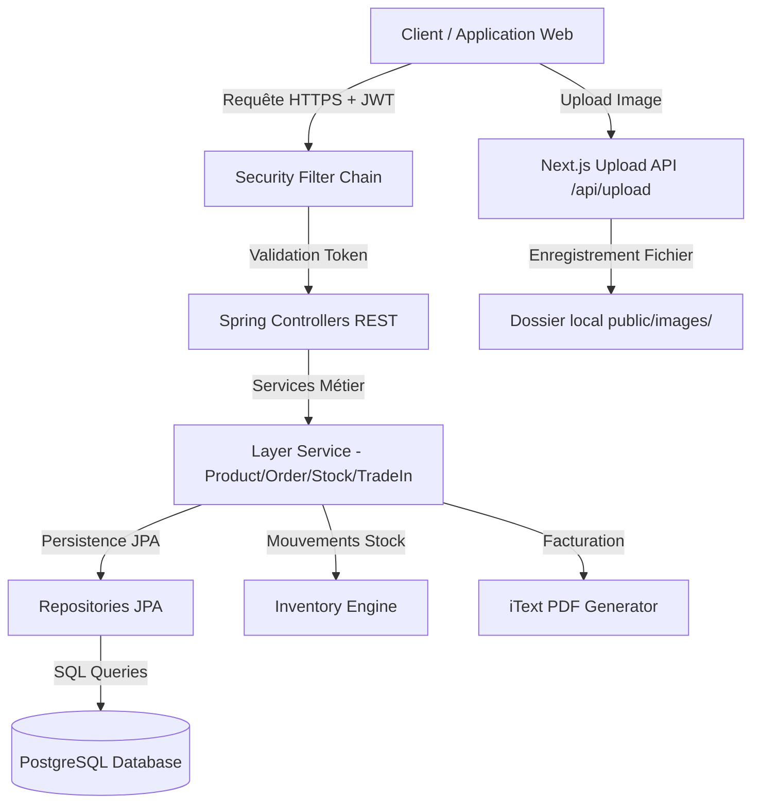

# 🌍 AfricaNet — Rapport d'Architecture & Document des Exigences (RAD)

> **Plateforme E-Commerce de Matériel Informatique Reconditionné & Système Intelligent de Reprise (Trade-In)**

---

## 📋 Table des Matières
1. [Présentation Générale & Vision](#1-présentation-générale--vision)
2. [Architecture Système & Stack Technique](#2-architecture-système--stack-technique)
3. [Schéma d'Architecture & Flux de Données](#3-schéma-darchitecture--flux-de-données)
4. [Spécifications des Modules & Fonctionnalités](#4-spécifications-des-modules--fonctionnalités)
   - [A. Front-Office (Client)](#a-front-office-client)
   - [B. Back-Office (Administration)](#b-back-office-administration)
5. [Tests Unitaires & Assurance Qualité](#5-tests-unitaires--assurance-qualité)
6. [Guide d'Installation & Déploiement](#6-guide-dinstallation--déploiement)

---

## 1. 🎯 Présentation Générale & Vision

**AfricaNet** est une plateforme web moderne et performante dédiée au marché tunisien et africain pour la vente de matériel informatique (PC portables, ordinateurs de bureau, écrans, accessoires) neuf, reconditionné ou d'occasion garanti, couplée à un système innovant de **Reprise/Trade-in** permettant aux clients de revendre leur ancien matériel.

### Objectifs Majeurs du Projet :
- **Économie Circulaire & Éco-responsabilité** : Revalorisation des équipements informatiques professionnels.
- **Transparence & Qualité** : Certification rigoureuse des états des produits (`Neuf`, `Reconditionné`, `Occasion`).
- **Expérience Utilisateur d'Exception** : Interface dynamique, réactive, élégante avec tableaux de bord analytiques en temps réel et exportations de données.

---

## 2. 🛠️ Architecture Système & Stack Technique

Le projet repose sur une architecture découplée **Client-Serveur (REST API + SPA)** garantissant une haute scalabilité, une maintenance aisée et une séparation nette des responsabilités.

```
                  ┌────────────────────────────────────────┐
                  │       Client Web (Browser)             │
                  └──────────────────┬─────────────────────┘
                                     │ HTTP / HTTPS (JSON)
                                     ▼
                  ┌────────────────────────────────────────┐
                  │       Frontend Next.js 16 (React 19)   │
                  │   App Router · SSR / Static / Dynamic  │
                  └──────────────────┬─────────────────────┘
                                     │ REST API / JWT
                                     ▼
                  ┌────────────────────────────────────────┐
                  │     Backend Spring Boot 3.4 (Java 17)  │
                  │   Spring Security 6 · JPA / Hibernate  │
                  └──────────────────┬─────────────────────┘
                                     │
                        ┌────────────┴────────────┐
                        ▼                         ▼
            ┌───────────────────────┐ ┌──────────────────────┐
            │ Base PostgreSQL 15    │ │ Stockage Local       │
            │ Schema Liquibase DB   │ │ public/images/       │
            └───────────────────────┘ └──────────────────────┘
```

### 🧰 Stack Technique Backend :
- **Langage & Framework** : Java 17, Spring Boot 3.4.x
- **Sécurité & Authentification** : Spring Security 6, JWT (HMAC-SHA256), hachage BCrypt (Strength 12), Architecture Stateless
- **Persistance & Base de données** : Spring Data JPA, Hibernate 7, Database PostgreSQL 15, Migration de schéma automatique Liquibase
- **Mappers & Utilities** : MapStruct, Lombok, Jackson JSON
- **Génération de Documents** : iText 7 (Génération automatique des Factures PDF)
- **Tests & Assurance Qualité** : JUnit 5, Mockito, AssertJ

### 🎨 Stack Technique Frontend :
- **Framework Web** : Next.js 16.2 (Turbopack, App Router)
- **Bibliothèque UI** : React 19, TypeScript
- **Design & Styles** : Vanilla CSS 3 moderne, variables CSS dynamiques, Glassmorphism, animations fluides
- **Gestion d'état & Flux** : React Context API (`CartContext`, `AdminGuard`), Hooks personnalisés
- **Data Visualization & Composants** : Recharts (Histogrammes interactifs & Camemberts), Lucide-React Icons

---

## 3. 📊 Schéma d'Architecture & Flux de Données



---

## 4. ⚙️ Spécifications des Modules & Fonctionnalités

### A. Front-Office (Client)

#### 1. Page d'Accueil (`/`)
- Section Hero dynamique avec présentation des offres informatiques reconditionnées.
- Produits vedettes, badges d'état (`Neuf`, `Reconditionné`, `Occasion`) et garanties.
- Avantages clients (Livraison rapide, Garantie certifiée, Paiement sécurisé).

#### 2. Catalogue de Produits (`/catalogue`)
- Filtrage multi-critères en temps réel : par Categorie, Marque, État de reconditionnement, et Tranche de prix.
- Recherche textuelle full-text instantanée.
- Cartes produits interactives avec bouton d'ajout direct au panier.

#### 3. Fiche Produit Détaillée (`/produit/[id]`)
- Galerie d'images interactive avec aperçu grand format.
- Informations techniques complètes, spécifications et tags.
- État du stock en direct (`En stock` / `Rupture`).

#### 4. Module de Demande de Reprise / Trade-In (`/reprise`)
- Formulaire multi-étapes interactif (Sélection du type d'appareil, marque, modèle, état).
- **Téléversement de photos depuis le PC** : Téléversement instantané enregistré dans `/public/images/`.
- Prévisualisation et possibilité de supprimer les images sélectionnées.
- Soumission et suivi du dossier dans l'espace client.

#### 5. Panier & Processus de Commande (`/panier`, `/checkout`)
- Panier dynamique alimenté par Context API.
- Calcul automatique de la TVA (19%), des frais de livraison (7 TND) et gratuité dès 200 TND d'achat.
- Intégration du paiement en ligne (Simulateur / Passerelle Flouci).

---

### B. Back-Office (Administration)

#### 1. Tableau de Bord Analytique (`/admin`) — *100% Dynamique*
- **Cartes KPI en Temps Réel** : Chiffre d'affaires total accumulé, Nombre total de commandes, Demandes de reprise actives, Alertes de stock critique.
- **Graphique de l'Évolution des Ventes** : Histogramme interactif avec sélecteur de période temporelle :
  - **Par Jour** : Ventes regroupées du Lundi au Dimanche.
  - **Par Semaine** : Ventes regroupées par semaines du mois (`Sem 1` à `Sem 4`).
  - **Par Mois** : Ventes réparties sur l'année (`Jan` à `Déc`).
- **Graphique Donut Répartition par État** : Calcul automatique des pourcentages de stock selon la condition (`Neuf`, `Reconditionné`, `Occasion`).
- **Suivi Direct** : Tableau des 5 dernières commandes et alertes de stock réelles.

#### 2. Gestion du Catalogue Produits (`/admin/produits`)
- Consultation paginée des produits avec badges de statut et visuels.
- **Filtres Dynamiques** : Catégories et Marques extraites dynamiquement depuis les données réelles backend.
- **Création & Modification de Produit** : Modal complet permettant d'uploader des photos directement depuis le PC, gérer les spécifications et les prix.
- **Exportation Excel / CSV** : Exportation de la liste des produits en un clic (`export_produits_YYYY-MM-DD.csv`) avec encodage UTF-8 BOM pour une ouverture parfaite sous Microsoft Excel.

#### 3. Gestion du Stock (`/admin/stock`)
- Suivi de la quantité totale, réservée et disponible par produit.
- Détection automatique des ruptures de stock et franchissements du seuil d'alerte.
- **Exportation de l'Inventaire** : Exportation Excel/CSV de l'état complet du stock (`export_inventaire_stock_YYYY-MM-DD.csv`).

#### 4. Gestion des Commandes & Facturation (`/admin/commandes`)
- Suivi du cycle de vie des commandes (`PENDING` ➔ `CONFIRMED` ➔ `PROCESSING` ➔ `SHIPPED` ➔ `DELIVERED`).
- Impression / Téléchargement automatique de la facture officielle au format PDF générée via iText 7.

---

## 5. 🧪 Tests Unitaires & Assurance Qualité

L'application bénéficie d'une suite complète de tests unitaires backend développés avec **JUnit 5**, **Mockito** et **AssertJ**, garantissant le respect des règles métiers sans dépendance externe :

| Classe de Test | Domaine / Service | Scénarios Couverts |
|---|---|---|
| **`ProductServiceTest`** | Produits | Recherche paginée, Création, Soft delete (désactivation), Gestion des erreurs |
| **`StockServiceTest`** | Stock | Mouvements d'entrée/sortie (`IN`/`OUT`), calcul du stock disponible, alerte stock bas |
| **`OrderServiceTest`** | Commandes | Consultation admin, Changement de statut de commande, calculs financiers |
| **`TradeInServiceTest`** | Reprise (Trade-In) | Validation des demandes, sécurité et droits d'accès utilisateur vs admin |
| **`AuthServiceTest`** | Sécurité / Auth | Inscription, hachage BCrypt, validation des doublons d'e-mail, authentification JWT |

---

## 6. 🚀 Guide d'Installation & Déploiement

### Prérequis
- Java 17+ & Maven 3.8+
- Node.js 18+ & npm 9+
- PostgreSQL 15+

### A. Lancement du Backend (Spring Boot)
```bash
# Se placer à la racine du projet
cd africanet

# Compiler et lancer l'application
.\mvnw.cmd spring-boot:run
```
> Le serveur backend démarre sur `http://localhost:8090` (Swagger UI : `http://localhost:8090/swagger-ui.html`).

### B. Lancement du Frontend (Next.js)
```bash
# Se placer dans le dossier frontend
cd africanet-frontend

# Installer les dépendances (si première fois)
npm install

# Lancer en mode développement
npm run dev
```
> L'interface web est accessible sur `http://localhost:3000`.

---
*AfricaNet — Plateforme d'excellence e-commerce & reconditionné informatique.*
